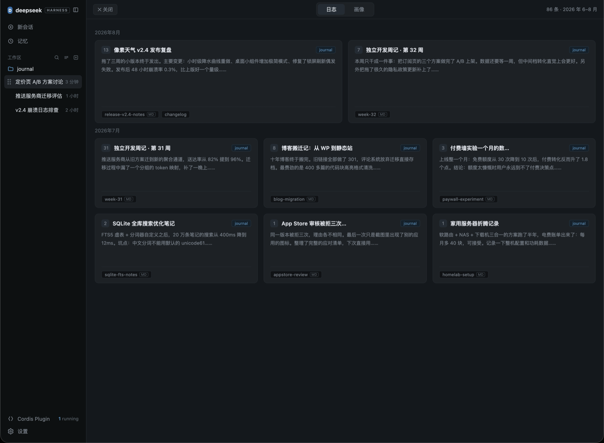

# dsh-plugin-jinji · 谨迹记忆面板

> 一个 DeepSeek Harness 插件：在网页界面的左侧栏加一个「记忆」入口，点开就能浏览你的日志和人物 / 产品画像。**不需要编译，不依赖任何第三方包**。

[](https://github.com/quan2005/dsh-plugin-jinji/releases)
[](./LICENSE)



## 这是什么

**核心理念**：把「记忆」直接带进 DeepSeek Harness，让它成为这个工具自带的记忆能力——**不需要安装任何其他软件**。

这里的「记忆」是**双轨**的一套机制（这也是它与大多数记忆系统最大的不同）：

- **流水记忆（日志）**：每天用录音、截图、粘贴文字记录素材，由 AI 整理成结构化日志（事件流），按 `yyMM/DD-标题.md` 存放在 `.journal/memory/`；
- **画像记忆（画像）**：从事件流里持续提炼出的**独立实体画像**——人物档案（身份、关切、决策模式……）与产品档案，每个实体一份，存放在 `.journal/identity/`；画像又反哺对后续事件的理解。

这套理念最初在谨迹（JournalClaw）里成型，本插件把它**原生落地在 DeepSeek Harness 本身**：只要 DSH + 这一个插件，左侧栏就有「记忆」入口——按时间流浏览日志、按分组浏览画像、点开看全文；日志与画像的写入则由 DSH 里的 AI 会话按同一套目录约定完成。谨迹桌面应用不是前提，它是这套理念的来源。

适合**所有需要在 DeepSeek Harness 里拥有记忆能力的人**。这是一个**极简的文本记忆系统**：记忆的实体就是纯文本文件（Markdown 日志 + 画像档案），没有数据库、没有复杂后台；组织与维护**以大模型为核心驱动**——AI 负责把碎片整理成结构、判断什么值得记、如何更新画像，软件本身只提供最简单的读写与浏览界面。

## 装一个

```sh
dsh plugin --profile web add github:quan2005/dsh-plugin-jinji
# 重启 dsh web
```

插件找日志库的顺序：配置文件里写的 `root` → 环境变量 `DSH_JINJI_ROOT` → dsh 启动时所在的目录。示例见 [examples/profile-patch.yml](examples/profile-patch.yml)。

## 能做什么

- 左侧栏「新会话」下方多一个「记忆」按钮，样式和官方按钮一致（收起成窄栏时自动变图标）
- 日志页：按月份分组的卡片瀑布流（日期、主题标签、一句话摘要、来源文件）
- 画像页：按「本人 / 产品 / 所在团队」分组的画像卡片
- 点卡片看详情：左边是排版好的正文（也可切到原始文本），右边是当月日志列表
- 面板只盖住中间区域，左侧栏随时可以点；点侧栏任意位置面板自动收起；Esc 或 × 也能关
- **启动注入**：每个新会话开始时，自动把最近日志与全部画像的摘要注入上下文（`config.startupContext: false` 可关）
- **主动书写**：会话同时注入一份记忆书写规范（什么时候记、日志/画像怎么写），让 DSH 里的 AI 会话像记忆管家一样主动沉淀记忆，而不只是读取
- 颜色完全跟随 DeepSeek Harness 官方深色主题；所有内容都做了转义和路径校验，只读不改

## 文档（写给开发者）

| 文档 | 讲什么 |
|---|---|
| [docs/architecture.md](docs/architecture.md) | 插件怎么分成「服务端部分」和「浏览器部分」、数据怎么流动、官方接口；记忆系统核心架构：**summary 分层加载 + 双轨记忆（流水 / 画像实体）+ 读写闭环（启动注入）**，配图 |
| [docs/api.md](docs/api.md) | 后台接口的完整约定：请求、响应字段、配置项、兼容边界 |
| [docs/design-decisions.md](docs/design-decisions.md) | 每个重要取舍的记录：为什么这么做、理由、有什么风险（ADR-0001 ~ 0010） |
| [docs/development.md](docs/development.md) | 怎么改代码、怎么调试、改完怎么验证、前人踩过的坑 |
| [CONTRIBUTING.md](CONTRIBUTING.md) | 想贡献代码时的规矩 |
| [CHANGELOG.md](CHANGELOG.md) | 每个版本改了什么 |

## 开发

```sh
npm run check    # 检查代码语法（本项目无需编译，这是唯一的"检查步骤"）
npm run smoke    # 用模拟环境跑一遍自检（scripts/smoke.mjs）
npm run pack     # 预览发布包里会包含哪些文件
```

## 许可证

[MIT](./LICENSE) © 2026 dsh-plugin-jinji contributors
