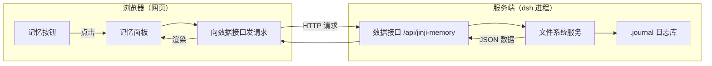
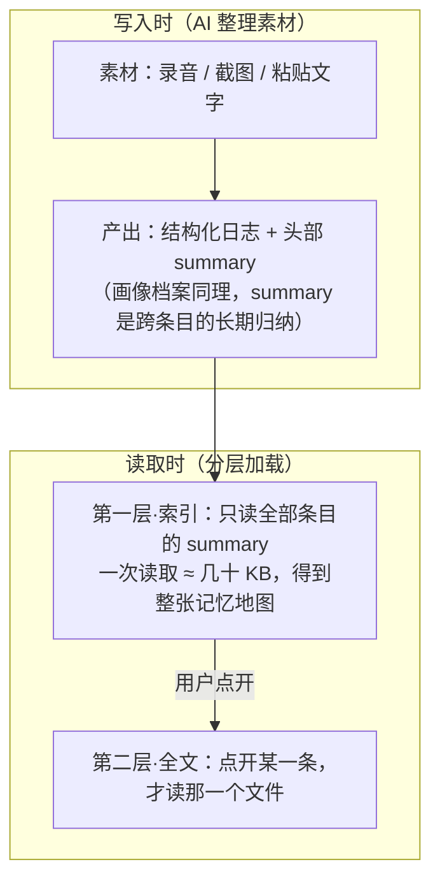
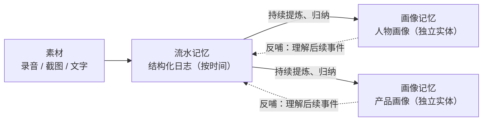
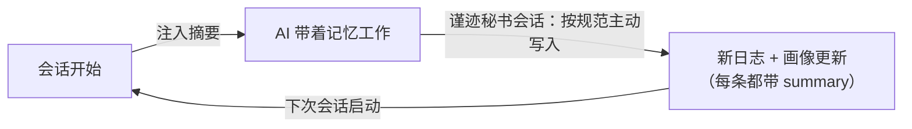
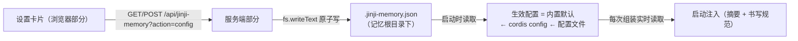
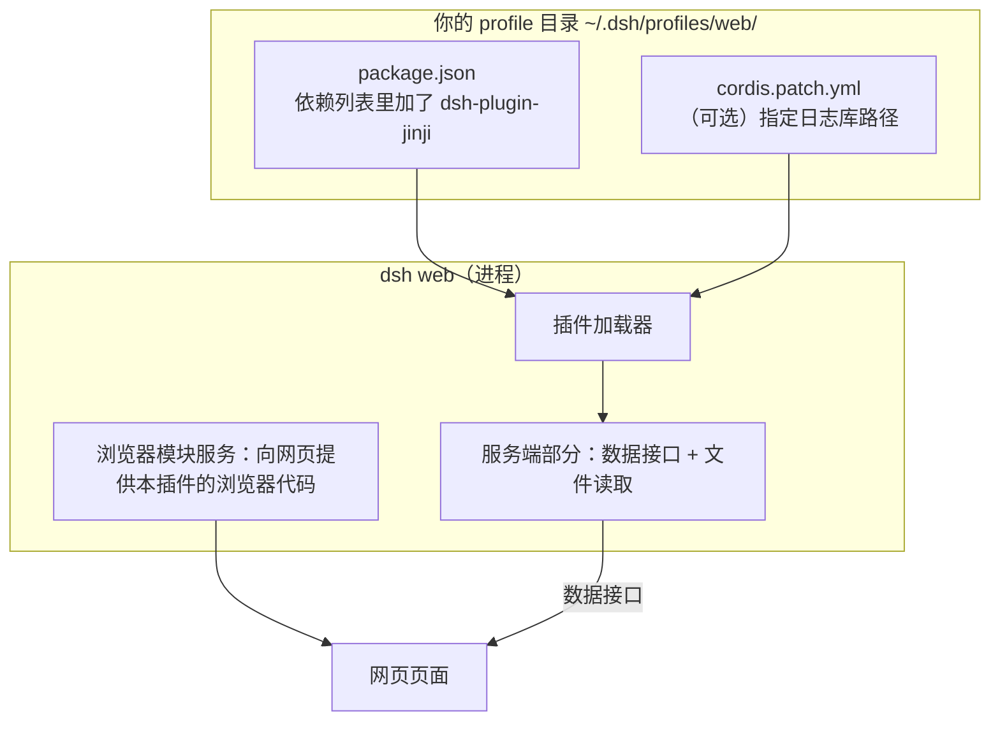

# 架构设计

> 这个插件的整体结构、数据是怎么流动的，以及它用到了 DeepSeek Harness 的哪些官方接口。建议先知道两件事：DeepSeek Harness 的「配置文件分层」（profile → 组合包 → 补丁层）和「一个插件可以同时跑在服务端和浏览器里」这个基本模型（官方叫 dual-face 包）。

## 1. 一句话总览

本项目是一个 **不需要编译、不依赖任何第三方包** 的 DeepSeek Harness 插件。它由两个部分组成，分别跑在两个环境里：

```
dsh-plugin-jinji/
├── package.json          # 插件声明：告诉 DSH 这是一个带界面的插件
├── cordis.patch.yml      # 安装时自动生效的配置（把插件挂进系统）
├── lib/
│   ├── index.js          # 服务端部分（跑在 Node 里）：读文件、开接口
│   └── client.js         # 浏览器部分（跑在网页里）：按钮 + 面板
└── docs/                 # 文档（本目录）
```

所谓「两个部分」，是因为**浏览器碰不到磁盘，Node 碰不到页面**：

| 部分 | 文件 | 运行在 | 能做什么 |
|---|---|---|---|
| 服务端部分 | `lib/index.js` | dsh 的 Node 进程 | 读日志库文件、提供数据接口、做路径校验 |
| 浏览器部分 | `lib/client.js` | 网页（http://127.0.0.1:3080） | 往侧栏插入按钮、渲染面板、处理点击 |

两者之间只通过一个数据接口说话：浏览器部分发请求 → 服务端部分读文件 → 返回 JSON → 浏览器渲染。

## 2. 数据是怎么流动的



一步步说：

1. **安装后启动**：服务端部分注册好数据接口；浏览器部分随页面加载，插入侧栏按钮。
2. **点「记忆」**：面板立即出现（先显示"加载中"），同时向数据接口要一份索引。
3. **服务端整理索引**：按时间倒序扫描 `.journal/memory/yyMM/*.md`（最多 120 条），再扫描 `.journal/identity/*.md`（本人 → 产品 → 其他人，按团队分组）；每条只取 frontmatter 里的 `summary` / `tags` / `sources` 和标题。
4. **浏览器渲染**：所有内容先做 HTML 转义再放进页面（防止日志内容破坏页面），卡片上绑定点击事件。
5. **点卡片看详情**：带着文件路径再向接口要全文，浏览器用一个小型排版器把 Markdown 变成排版好的 HTML。

## 2.5 记忆系统的核心架构：写时带摘要，读时先读摘要

这个插件只是记忆系统的「浏览界面」。记忆系统本身的核心架构是一句话：

> **AI 在做记录的同时写下一段 summary；读取记忆时先只读这些 summary，点开才读全文——和 skill 的分层加载是同一个模式。**

### 写入时：记录 + 摘要，一次成对产出

AI 整理素材时，在每条记录头部用 frontmatter 写下 `summary`（结论先行、有信息量的几句话）。摘要不是附加功能，而是**写入动作的一部分**：整理的成本在写的那一刻一次性付清。

### 读取时：两层加载



| 层 | 读什么 | 成本 | 用在哪 |
|---|---|---|---|
| 索引层 | 每条记录 frontmatter 里的 `summary`（+ 标题、标签、来源） | 恒定小成本，与库大小无关的「记忆地图」 | 面板的卡片与列表、启动时的记忆快照 |
| 全文层 | 被点开的那一个文件 | O(1) | 面板的详情视图 |

### 为什么说它「类似 skill 的分层加载」

DeepSeek Harness 的技能（skill）目录只先暴露每个技能的 `name` / `description`（几乎零成本），真正调用时才加载 SKILL.md 全文。本系统把同一个模式用在了「记忆」上：**summary 就是记忆条目的 description**。

### 大模型为什么是核心驱动

summary 的撰写、合并、去重、随新素材的更新，全部由 AI 在会话里完成；代码层不做任何语义理解，只负责「按约定读取 summary」。这就是「极简文本记忆系统 + 大模型为核心驱动」的落地方式：文件格式保持最简单，智能全部在模型侧。

### 本插件里就是这样实现的

启动注入在本插件 Host 侧落地：监听 `agent/session-start`，异步用 `composeSummary()`（复用 `listJournals` / `listPersonas` / `parseFrontmatter`）组装快照并按会话缓存；`systemPrompt` 上下文提供器（顺序 130）只同步返回缓存。约束与降级策略见 [api.md](api.md#31-启动时的记忆摘要注入) 与 ADR-0009。

### 与本插件的关系

- 面板的 `action=index` 接口**只读 summary**，正是索引层的实现；
- 点开卡片时的 `action=read` 才是全文层；
- 这套分层也让「启动时注入记忆快照」成为可能：最近 N 条 summary + 全部画像 summary 只是几十 KB，放进提示词成本可忽略。

## 2.6 两种记忆：流水记忆 + 画像记忆

这套系统最特别的不是「记流水」，而是它有**两种记忆**，并且第二种是从第一种里长出来的独立实体：



| 记忆 | 本质 | 回答的问题 | 形态 |
|---|---|---|---|
| 流水记忆（日志） | 按时间顺序的事件流 | 发生了什么 | 一条条日志（`yyMM/DD-标题.md`） |
| 画像记忆（画像） | 从事件流里提炼出的**独立实体** | 这个人 / 这个产品是什么样的 | 每个实体一份档案（`.journal/identity/`），跨时间、跨事件归纳 |

### 画像的提炼方式

画像不依附于任何单条日志：它是 AI 在每次接触新素材时，从流水里**渐进式提炼**出来的——

- 人物画像按五维归纳：身份与位置、关切与议程、决策模式、能力与盲区、与用户的关系；
- 产品画像记录定位、战略判断与关键决策；
- 提炼是分阶段的（首次出现建档 → 再次出现补全 → 多次出现且有决策行为才深挖），避免为一面之缘的人建档。

### 双轨如何互相作用

1. 新素材进来 → 先整理成流水日志（事件）；
2. 整理过程中判断是否触及已有实体 → 需要时就更新画像（提炼）；
3. 下次再遇到同一实体 → 先读它的画像（summary 索引层），带着背景理解新事件。

事件滋养实体，实体反哺对事件的理解——循环往复，画像越用越准。

### 与其他记忆系统的差异

大多数记忆系统是**单轨**的：要么只有对话/事件流水（记了但无法提炼），要么只有碎片化事实检索（有事实但没有"人/产品"的完整形象）。本系统是**双轨**：事件流 + 实体画像，实体从事件流中长出来、又持续反哺事件的理解——这是它与众不同、也最有价值的地方。

## 2.7 主动书写：书写规范由「谨迹秘书」预设承载，形成「读 → 写」闭环

只有「读」的记忆是死的；但「写」的规则也不该塞进每一个会话的提示词——大多数会话并不需要记东西。所以书写规范**不做全局注入**，而是做成一个用户自选的 **Agent 预设「谨迹秘书」**（见 ADR-0012）：在「设置 → 插件配置 → 谨迹记忆」里一键安装，新建会话时选用它，那个会话就成为记忆管家；普通会话完全不受影响。

预设的人设段落携带完整书写规范：

- **什么时候写**：会话收尾 / 重要结论与决策 / 新实体出现或画像变化 / 用户说「记住这个」；
- **怎么写**：日志的路径与 frontmatter 约定（`title` / `date` / `summary`）、画像档案的文件名与「一个实体一份档案」原则、建档门槛；
- **不写什么**：一次性琐事、用户不让记的内容。

写入动作由 AI 会话用自己的文件工具完成——插件只负责把「格式契约」讲清楚，语义判断全部留在模型侧，与 2.5 节「大模型为核心驱动」一脉相承。预设就是用户预设目录里的普通文本文件，想改规则直接改文件。

于是整个系统闭合成一个环：



安装机制：插件通过 roster 的官方创作通道 `copy('standard', 'jinji', '谨迹秘书')` 复制当前版本的 standard 预设，把 persona 行整段替换为秘书人设（书写规范全文 + 实际记忆根目录），写入 `preset.yml`，最后做一次挂载校验（`standingKeyFor`）。预设独立于插件升级：插件更新不会改动已安装的预设；想跟进 standard 的新版本，删除预设后重新安装即可。

## 3. 用到了哪些官方接口

| 接口 | 怎么用 | 说明 |
|---|---|---|
| `fs` 服务 | 声明依赖 `fs` | 官方抽象文件系统（读写都走它）。不用 Node 自带的文件 API，这样官方沙箱策略仍然生效 |
| `webServer` 服务 | 声明依赖 `webServer` | 用它注册数据接口 `GET /api/jinji-memory`；返回的注销函数交给 `ctx.effect`，插件卸载时自动清理 |
| `dsh.bundle` | `package.json` 里声明 | 告诉 DSH：这个包带一份配置，装进 profile 时自动应用 |
| `dsh.client` | `package.json` 里声明 | 告诉 DSH：这个包还有浏览器部分（注意必须是对象写法，写错会让整个网页应用启动失败） |
| `window.__ModuleLoader__` | `lib/client.js` 手写 | 官方浏览器模块的分发格式：网页在用到时才执行模块代码 |
| 官方界面插槽（slots） | **不使用** | 本项目按钮和面板都绕开了官方插槽，原因见 [ADR-0001](design-decisions.md#adr-0001) |

## 4. 几个关键机制

### 4.1 按钮是怎么放进侧栏的

「新会话」按钮是官方界面里没有对外开口的私有区域（没有官方插槽可用）。本插件的做法：

1. 用一个稳定不变的类名后缀 `[class*="_newSession"]` 找到它（前面的随机前缀每次构建都会变，后缀不会）；
2. 把「记忆」按钮插到它正下方；
3. **复制它的实际样式**：读取这个按钮当前生效的全部样式，逐项套用到「记忆」按钮上——所以任何主题下两者都长得一样，不需要自己写颜色；
4. 监听页面变化：按钮被官方界面重建时自动补回来；侧栏收起成窄栏（≤40px）时自动变成纯图标。

### 4.2 面板为什么只盖住中间

面板左边留出侧栏的实测宽度（`left = 侧栏宽度`），并且侧栏变宽变窄时实时跟随。这样打开面板时，左侧的会话列表、新会话按钮都还能正常用。

### 4.3 点侧栏自动关面板

面板打开期间，监听整个页面的点击：点到侧栏区域就收起面板（但不拦下这次点击——你点会话，面板收起、会话照常切换）；点到「记忆」按钮本身则跳过（避免关了又开）。

### 4.4 安全上做了什么

- **路径校验**：要读的文件必须位于 `.journal/` 之内，路径里不能有 `..`，读之前再用官方接口做一次归属校验；
- **内容转义**：日志内容在进入页面前全部转义，恶意文本不可能变成可执行代码；
- **写入范围**：插件自己不碰日志与画像文件（那些由 AI 会话写）；唯一的写入是记忆根目录下的配置文件 `.jinji-memory.json`——走 `fs.writeText` 原子写，字段逐一校验（类型 + 取值范围）后才落盘。

### 4.5 配置是怎么生效的

「设置 → 插件配置」页的配置卡片是官方 shell 预留的开放槽位（`settings.plugin.item`），但官方的 settings 命名空间只对内置插件白名单开放——所以本插件的配置走了自己的通道（见 ADR-0011）：



- 卡片用 shell 共享的 React 渲染（`require('react')`，不是本包依赖；拿不到就静默跳过，不影响按钮与面板）；
- 配置保存**无需重启**：提供器每次组装都读当前生效配置，下一个新会话立即采用新值；
- 配置文件跟着记忆库走：整库搬走，配置一起搬走。

## 5. 部署后的样子


