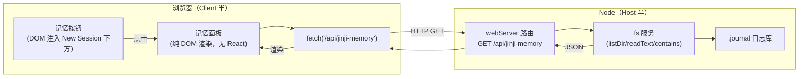
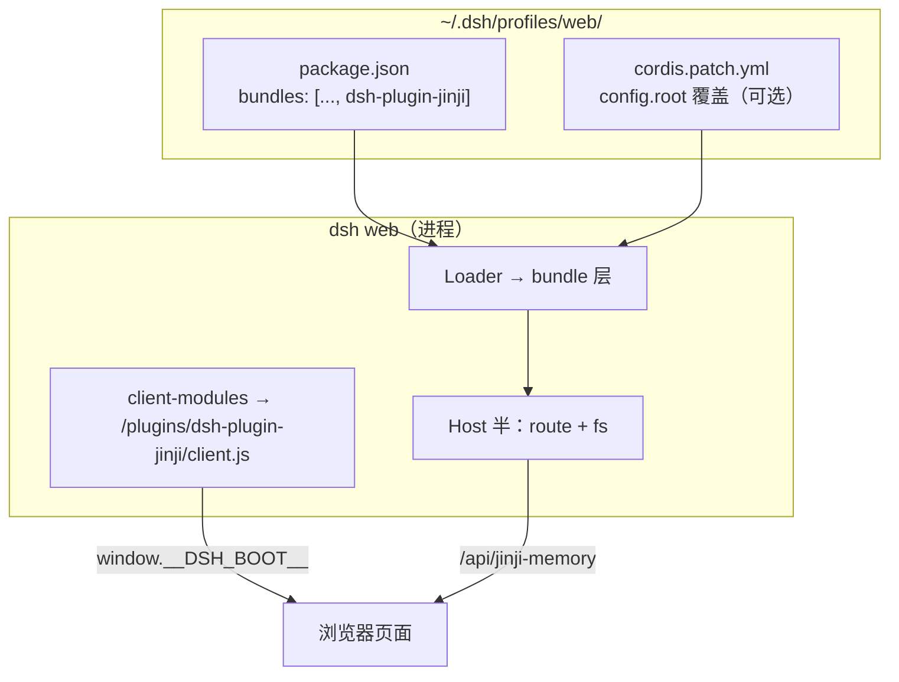

# 架构设计

> dsh-plugin-jinji 的系统架构、数据流与 DeepSeek Harness 集成点。阅读前提：了解 [DSH 官方架构](https://github.com/deepseek-ai/deepseek-harness/blob/master/docs/architecture.zh.md)（profile / bundle / patch 层、双半插件模型）。

## 1. 总体结构

本项目是一个 **零构建、零运行时依赖** 的 DeepSeek Harness **双半插件包（bundle）**：

```
dsh-plugin-jinji/
├── package.json          # dsh.bundle（组合包层）+ dsh.client（浏览器半声明）
├── cordis.patch.yml      # 组合包层：插入双半行（一条行，双面）
├── lib/
│   ├── index.js          # Host 半（Node）：数据路由 + 文件读取
│   └── client.js         # Client 半（浏览器）：入口按钮 + 面板（纯 DOM）
└── docs/                 # 文档体系（本目录）
```

一条插件行 `jinji-memory` 在 Host 与浏览器两侧同时物化（`dsh.client` 双面包模型），与官方 `dsh-client-*` 包同构。

## 2. 双半分工



| 半 | 文件 | 职责 | 依赖 |
|---|---|---|---|
| Host | `lib/index.js` | 数据路由：解析 frontmatter、组装 index、读全文；路径防护 | `ctx.fs`、`ctx.webServer`（均注入声明） |
| Client | `lib/client.js` | 侧栏按钮注入 + 全屏面板渲染 + 交互 | 仅浏览器原生 API（`document`/`fetch`/`MutationObserver`），**不 require 任何模块** |

## 3. 数据流

1. **激活**：bundle 层被 profile 应用 → Host 半注册路由 `/api/jinji-memory`；`dsh.client` 扫描器把 `./client` 导出加入浏览器模块表，页面加载时物化 Client 半。
2. **打开**：用户点击「记忆」→ `openPanel()` → 面板立即挂载（占位渲染）→ `fetch /api/jinji-memory?action=index`。
3. **索引**：Host 经 `fs.listDir` 枚举 `.journal/memory/yyMM/*.md`（倒序，截 120 条）与 `.journal/identity/*.md`（README 用户 → `product-*` 产品 → 人物，按区域分组），逐文件 `readText` 后解析 YAML frontmatter（`summary`/`tags`/`sources`）与首个 H1。
4. **渲染**：Client 用 `esc()` 转义全部数据后以 innerHTML 模板渲染（防注入），事件经 `data-jm-act`/`data-jm-rel` 二次绑定。
5. **详情**：点卡片 → `action=read&rel=…` → 全文返回 → 轻量 Markdown 渲染器输出 HTML。

## 4. DSH 集成点（seam 契约）

| 集成点 | 使用方式 | 说明 |
|---|---|---|
| `ctx.fs`（服务） | `inject: ['fs']` | 抽象文件系统：`resolve`/`stat`/`listDir`/`readText`/`contains`。不直接 `node:fs`，尊重沙箱策略 |
| `ctx.webServer`（服务） | `inject: ['webServer']` | `register({ kind: 'exact', path: '/api/jinji-memory', handler })`，返回 disposer 交给 `ctx.effect` |
| `dsh.bundle` | `package.json` → `{ patch: './cordis.patch.yml' }` | 安装进 profile 时自动应用的组合包层 |
| `dsh.client` | `package.json` → `{ platform: 'web', inject: [] }` | 浏览器模块表扫描声明；**必须为对象**（布尔值会让 client-modules 抛错） |
| `window.__ModuleLoader__` | `lib/client.js` 手写 bundle | 零构建客户端分发格式（惰性 factory，`/plugins/<id>/client.js` 启动时固化） |
| 槽位系统 | **不使用** | 面板与入口均绕过 slots（见 [ADR-0002](design-decisions.md#adr-0002)） |

## 5. 关键机制

### 5.1 入口注入（侧栏「记忆」按钮）

New Session 按钮是 shell 私有 DOM、无官方槽位。本插件在 Client 半启动时：

1. `document.querySelector('[class*="_newSession"]')` 语义后缀定位锚点（hash 前缀随构建变、语义后缀稳定）；
2. `insertAdjacentElement('afterend', btn)` 插入按钮；
3. `getComputedStyle(anchor)` **逐属性拷贝内联样式**——几何、颜色、对齐完全跟随官方按钮（含主题变量），不硬编码色值；
4. `MutationObserver` 监听子树与 class 变更：按钮被 shell 重建时自动重新挂接；宽/窄栏（rail ≤40px）状态跟随锚点实测宽度。

### 5.2 面板定位

`position: fixed; top:0; right:0; bottom:0; left:<侧栏实测宽度>px`——只覆盖内容区，左侧栏始终可见可点。打开期间监听 `resize` + DOM 变更实时重测宽度。

### 5.3 自动关闭

面板打开期间注册**捕获阶段**全文档点击监听：命中 `[class*="_sidebarCol"]` 即关闭（不拦截侧栏自身点击）；命中 `[data-jinji-nav]`（本按钮）跳过，避免关开闪烁。监听随面板关闭移除。

### 5.4 安全模型

- 路径防护：`rel` 必须以 `.journal/` 开头、无 `..`/空段，且 `fs.contains(journalRoot, file)` 校验；
- 输出安全：前端所有数据经 `esc()`（`& < > " '` 转义）后才进入 innerHTML；
- 只读：本插件不写日志库任何文件。

## 6. 部署拓扑


